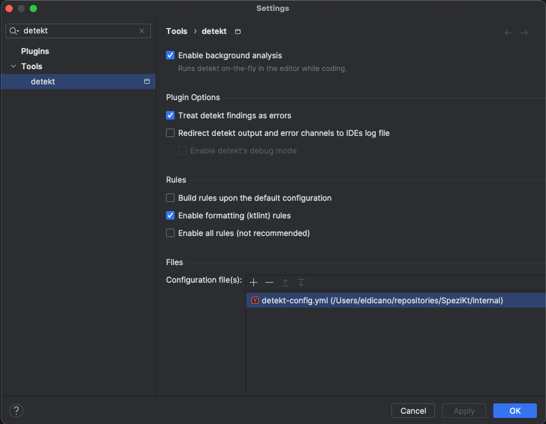
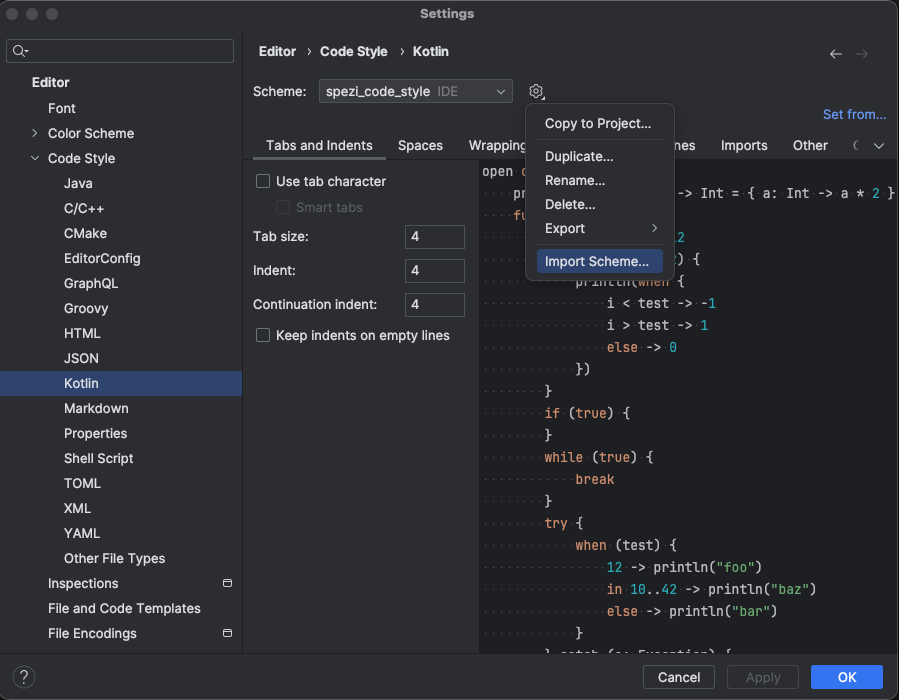
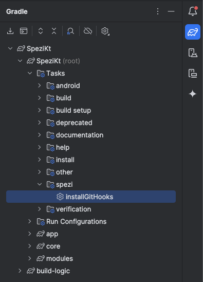

# Detekt Guide

The Spezi project utilizes [Detekt](https://detekt.dev/) as a static code analyzer for Kotlin. This guide contains relevant information regarding Detekt setup and its usage.

## Introduction

The project relies on the following Detekt dependencies:
1. Detekt plugin: `io.gitlab.arturbosch.detekt`
2. Detekt formatting library: `io.gitlab.arturbosch.detekt:detekt-formatting:${version}`

Detekt is configured in the root project's `build.gradle.kts` file via the `Project.setupDetekt()` method, and it's applied to all subprojects (modules) of the project. It utilizes the [`detekt-config.yml`](../detekt-config.yml) configuration file, which contains all Detekt rules that the project complies with.

Detekt plugin will create several Gradle tasks for the root project and for each module. You can run these tasks either via the terminal by using Gradle Wrapper at the root of the project:

```bash
# Run Detekt analysis on the root project
./gradlew detekt

# Run Detekt analysis on a specific module
./gradlew :moduleName:detekt
```

It's important to note that the Detekt task is configured to automatically correct any found violations (if the issue is autocorrectable); otherwise, the fix should be performed manually.

Furthermore, Detekt is configured as a job in a [Github action](https://github.com/alaegin/Detekt-Action?tab=readme-ov-file) to run on every [pull request](../../.github/workflows/pull_request.yml) pointing to the main project branch. The job is configured to comment violations in the `Files changed` section of the pull request.

## Android Studio and local setup

In addition to the project setup, we advise making use of [Android Studio Detekt plugin](https://plugins.jetbrains.com/plugin/10761-detekt) to have in-editor support pointing out potential violations and in-editor autocorrection. In order to install the plugin, follow these steps:

1. Open `Android Studio` > `Settings` > `Plugins` > `Marketplace`
2. Search for `detekt` and install it
3. After installing, open `Android Studio` > `Settings` > `Tools` > `detekt` and enable the following configurations:
    1. `Enable background analysis`
    2. `Treat detekt findings as errors`
    3. `Enable formatting (ktlint) rules`
    4. Under `Files / Configuration files`, add the project's `detekt-config.yml` located at `SpeziKt/internal/detekt-config.yml`
4. Save the changes

<p align="center">
  
</p>

In order to comply automatically with some detekt rules, we advise to also perform the following configurations in Android studio

1. Open `Android Studio` > `Settings` > `Editor` > `General` > `On Save` and check `Ensure every saved file ends with a line break`
2. Open `Android Studio` > `Settings` > `Editor` > `Kotlin` > `Scheme` and on in the settings icon import [spezi_code_style.xml](../spezi_code_style.xml) file at `SpeziKt/internal/spezi_code_style.xml`. This will allow formatting with respect to detekt formatting rules when applying `Code` > `Reformat Code / File` commands in Android studio (or the corresponding shortcuts)

<p align="center">
  
</p>

## Git hook

To ensure that every code change satisfies Detekt rules, the project includes a `pre-commit.sh` script located at [internal/git-hooks/pre-commit.sh](../../internal/git-hooks/pre-commit.sh):

```bash
#!/bin/bash

echo "Running detekt..."
./gradlew detekt

detektStatus=$?
if [[ "$detektStatus" = 0 ]] ; then
    echo "Detekt run successfully"
    exit 0
else
    echo 1>&2 "Detekt found violations"
    exit 1
fi
```

The script can be installed as a `pre-commit` git hook, which runs Detekt (with autocorrection enabled) before a commit is executed. This ensures that applied changes conform to Detekt rules. To install the git hook, the project contains a Gradle task under the group `spezi`, which activates the hook:

<p align="center">
  
</p>

or by running the task via gradle wrapper from the root of the project:

```bash
./gradlew installGitHooks 
```

If you don't want to use the pre-commit hook, you can either delete it from the `.git/hooks` folder or disable it for a single commit using the `--no-verify` option:

```bash
git commit -m "Your commit message" --no-verify
```